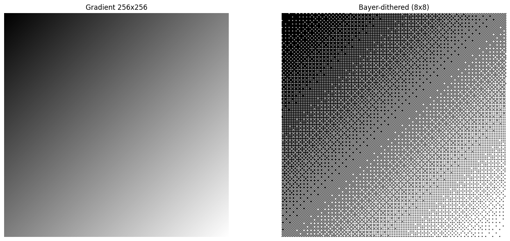
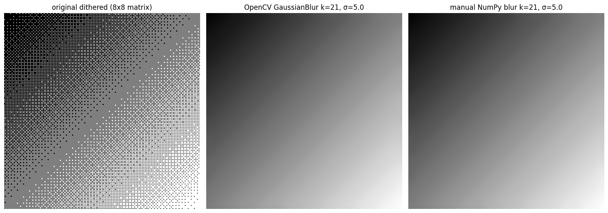
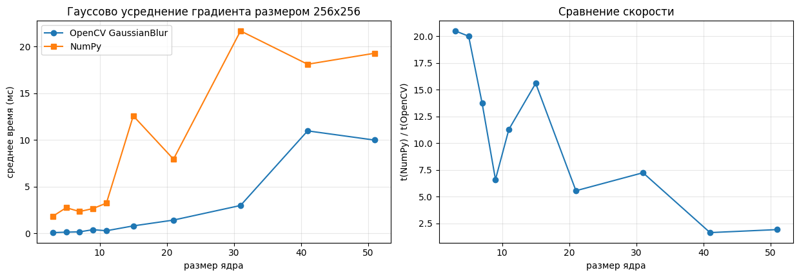

# Лабораторная работа №1
## Вариант 1: Усредняющий фильтр Гаусса с переменным размером ядра и параметрами гауссианы.
### Теоретическая база
Усреднение по Гауссу -- свёрточный фильтр, для которого ядро определяется
через функцию плотности нормального распределения
$N(x; \mu,\sigma) = \frac{1}{\sigma\sqrt{2\pi}}e^{-\frac{\left(x-\mu\right)^2}{2\sigma^2}}$.
### Описание разработанной системы
Разработанная система -- Jupyter Notebook, содержащий код на языке Python,
который реализует фильтр усреднения по Гауссу с двумя переменными параметрами
-- размером ядра $k$ и среднеквадратическим отклонением $\sigma$.
Фильтр реализован посредством библиотеки NumPy.
Данная реализация сравнивается с методом библиотеки OpenCV `GaussianBlur`.
В ходе выполнения кода в Notebook осуществляется sanity check реализации на Numpy
по отношению к таковой в OpenCV и после сравнивается производительность фильтра
при различных размерах окна свёртки. Тестовым случаем является двоичное изображение градиента с
дизерингом по Байеру. Так как усреднение по Гауссу является сепарабельным фильтром,
его реализация осуществляет фильтрацию в два прохода, по строкам и по столбцам изображения.
### Результаты работы
|Градиент|Размытие|Сравнение|
|--|--|--|
||||
### Выводы
Работа показала, что предложенная реализация усреднения по Гауссу медленнее таковой в OpenCV,
но разрыв сокращается по мере увеличения размеров ядра. Таким образом, для рядового пользователя
более предпочтительным будет использование фильтра из OpenCV.
### Использованные источники
1. https://docs.opencv.org/5.0/py_tutorials/py_imgproc/py_filtering/py_filtering.html
2. https://numpy.org/doc/stable/
